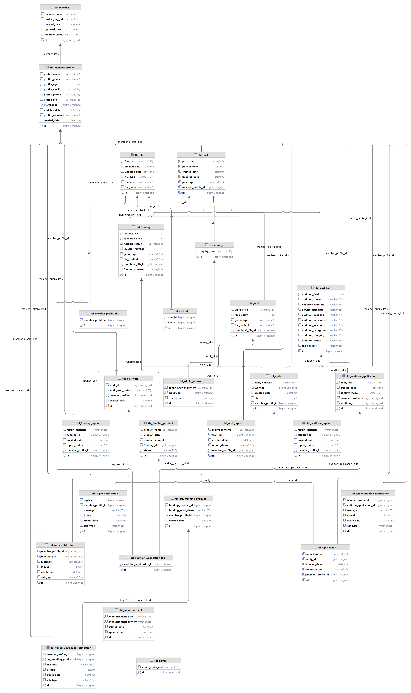

# GGuemteo |<a href="http://www.ggumteo.site/"> Spring Boot 프로젝트 : 창작과 협업을 위한 열린 콘텐츠 플랫폼(http://www.ggumteo.site/)</a>

## 🖥️ 프로젝트 소개
누구나 자신의 창작물을 공유하거나 판매하고, 펀딩을 통해 지원받을 수 있는 플랫폼으로, 필요한 인재를 모집하며 협업할 수 있는 창작 생태계를 제공합니다.

## 🕰️개발 기간
* 24.10.10일 - 24.11.15일

## 🧑‍🤝‍🧑 맴버구성 - 백엔드 업무
 - 팀장  : 최대환 - 메인 홈페이지, 영상-모집, 글-모집, 알림, 카카오 로그인, 회원가입
 - 부팀장 : 오현준 - 영상-작품, 글-작품, 영상-펀딩, 글-펀딩, 영상-메인, 글-메인
 - 팀원1 : 용호중 - 관리자 페이지, 문의사항
 - 팀원2 : 정지수 - 마이페이지, 신고
 
 
 ## ✨ 프로젝트 목적 
 배우, 감독, 작가 등 누구나 창작자가 될 수 있는 기회를 제공하고, 창작자와 후원자, 협업자가 연결될 수 있는 새로운 사회적 네트워크를 형성합니다. 이를 통해 창작물의 가치를 극대화하고, 창작자들이 자신의 작품을 경제적으로 활용하며 창의적인 협업을 통해 더 나은 작품을 만들어갈 수 있도록 지원하는 것을 목표로 합니다.
 
 ## ✨ 기획배경
 1. 다양한 역할을 하는 시대흐름
    현대 사회는 본업 외에도 부업, 창작 활동 등 다양한 형태로 자신의 역할을 확장할 수 있는 시대입니다. 배우, 감독, 스태프 등 창작 분야에서 원하는 도전을 통해 창작과 수익을 동시에 실현할 수 있는 기회가 필요합니다.
 2. 수익 분배의 불공정 및 자본 부족
    기존 콘텐츠 제작 환경에서의 불공정한 수익 분배와 자본 부족 문제는 창작자가 창작에 온전히 집중하지 못하게 합니다. 이를 개선하고 누구나 공정한 수익과 펀딩 기회를 얻을 수 있는 플랫폼이 필요합니다.

 ## ✨ 목적 및 기대 효과
 1. 협업 플랫폼으로의 성장 가능성
    다양한 협업 플랫폼의 성공 사례를 기반으로 창작자들이 배우, 감독, 스태프와 협력하여 작품을 완성할 수 있는 기회를 제공합니다. 이를 통해 공정한 수익과 성과를 나눌 수 있는 환경을 구축합니다.

 2. 새로운 창작 생태계 구축
    창작자와 협업자가 서로 연결되고, 창작물이 더 많은 사람들에게 공유될 수 있는 새로운 생태계를 조성하여 창작 활동의 경제성과 효율성을 극대화합니다.

## ⚙️ 개발 환경
- java
- jQuery
- Thymeleaf
- Spring Boot
- HTML, CSS, JS
- MySQL
- JDK 17.0.10
- YAML
- JSON
- REST:API
- Sourcetree
- DBeaver
- IntelliJ IDEA
- git, gitHub
- JUnit5
- POSTMAN
- Lombok
- Boot pay
- Kakao OAuth
- Cool SMS api
- Java Mail api
- Google SMTP

 ## 📌 프로젝트에서 맡은 역할 
- 프로젝트 팀장, 서비스 기획 및 전반적인 구성
- DB 및 컨트롤러 설계 
- 프론트 업무 : 영상-모집, 글-모집, 문의사항 작성페이지, 모집 상세 및 목록 반응형 웹페이지 
- 백엔드 업무 : 메인 홈페이지, 영상-모집, 글-모집, 알림, 카카오 로그인, 회원가입
- AWS 서버 배포 <a href="http://www.ggumteo.site/">GGumteo</a>

### 퍼블리싱 작업(회원가입/로그인) - <a href="https://github.com/code-hyun/ggumteo/wiki/맡은-기능-소개--(퍼블리싱)" > 상세보기 - WIKI 이동</a>
 1. 모집페이지  
 2. 문의사항 작성 페이지  
 3. 모집 상세 및 목록 반응형 웹페이지  

### 백엔드 작업(관리자 페이지) - <a href="https://github.com/ChoiDh05/GGumteo/wiki/%EB%8B%B4%EB%8B%B9%ED%95%9C-%EA%B8%B0%EB%8A%A5-%EC%86%8C%EA%B0%9C" >상세보기 - WIKI 이동</a>
 1. 영상 모집 (목록, 상세보기, 작성/수정, 검색, 신청하기)  
 2. 글 모집 (목록, 상세보기, 작성/수정, 검색, 신청하기) 
 3. 헤더 알림 (알림) 
 4. 메인 홈페이지 (통계, 서비스 소개) 
 5. 카카오 로그인 (상세보기) 
 6. 회원가입 (작성) 

## ✨ ERD

## ✨ 프로젝트에서 느낀점
 : 개발을 처음 배우는과정에서 이번 프로젝트에서는 팀장을 맡게되었습니다. 처음에는 개발에 대한 실력이 부족하고 팀장으로서의 역할도 처음이라 많은 어려움을 겪었습니다. 특히, 팀원들과의 원활한 의사소통과 프로젝트의 방향성을 조율하는 데 있어 시행착오도 많았습니다.

하지만 프로젝트를 진행하면서 부족했던 기술을 보완하기 위해 꾸준히 학습하고, 팀원들과의 긴밀한 협력을 통해 점차 실력을 향상시킬 수 있었습니다. 팀장으로서 팀원들의 의견을 조율하고 프로젝트의 목표를 공유하며 하나의 결과물로 나아가는 과정을 통해 의사소통 역량과 리더십이 크게 성장했다고 느낍니다. 또한, 팀원들과 협력하며 어려운 문제를 해결하고 목표를 달성하는 과정에서 협업의 중요성을 몸소 체감할 수 있었습니다.

이번 경험을 통해 얻은 기술적 성장과 팀장으로서의 경험은 앞으로의 개발자로서 큰 자산이 될 것이라 확신합니다. 앞으로도 더 나은 개발 실력과 리더십을 갖추기 위해 꾸준히 학습하고, 협업의 가치를 소중히 여기는 개발자가 되겠습니다.
